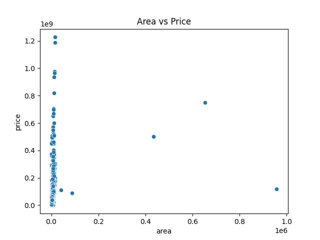
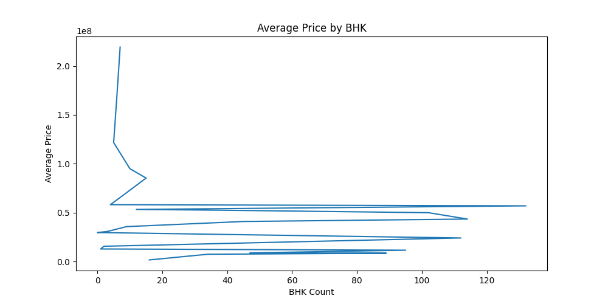
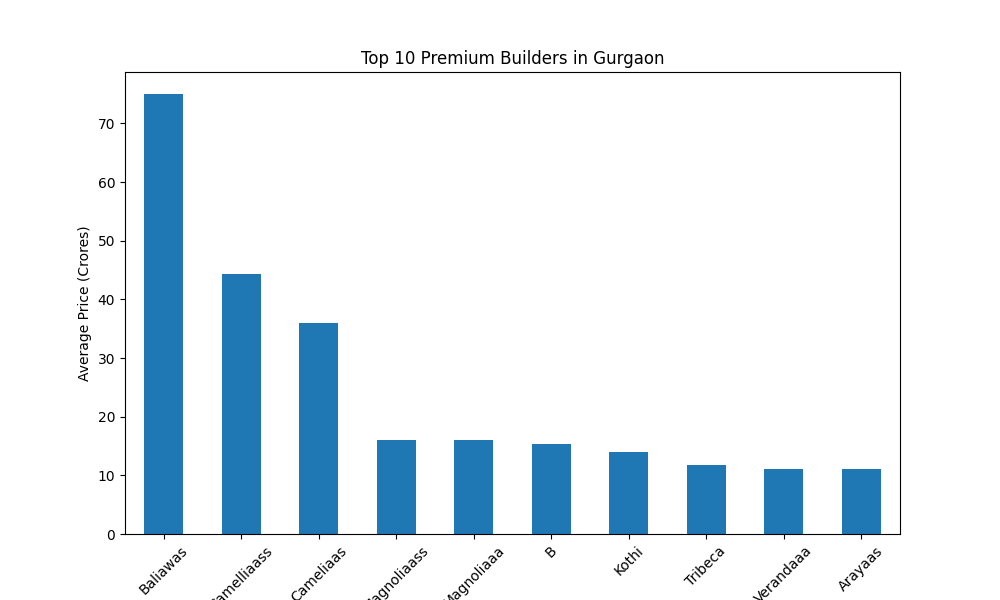
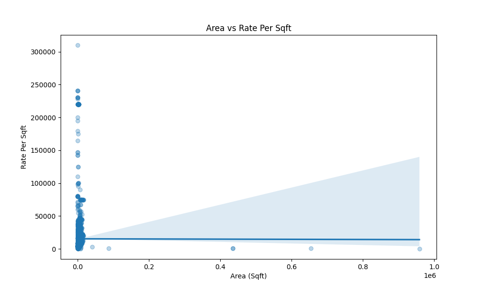

# Gurgaon Real Estate Market Analysis

## Project Overview

The real estate market in Gurgaon is highly dynamic, with property prices varying significantly across localities, property types, builders, and project status. This project aims to analyze residential property listings in Gurgaon to uncover pricing trends, identify premium locations, and generate business insights for buyers, investors, and real estate developers.

The analysis was performed using Python libraries such as Pandas, NumPy, Matplotlib, and Seaborn.

---

## Problem Statement

A real estate advisory firm operating in Gurgaon collected residential property listing data from multiple localities. The firm wants to leverage data analytics to answer key business questions and support data-driven decision-making for:

- Home Buyers
- Real Estate Investors
- Property Developers

The objective is to identify market trends, premium locations, pricing patterns, and the impact of factors such as area, builder reputation, property type, and RERA approval on property prices.

---

## Tools and Technologies Used

- Python
- Pandas
- NumPy
- Matplotlib
- Seaborn

---

## Dataset Information

The dataset contains residential property listings from various sectors of Gurgaon.

### Dataset Columns

- Price
- Status
- Area
- Rate Per Sqft
- Property Type
- Locality
- Builder Name
- RERA Approval
- BHK Count
- Society
- Company Name
- Flat Type

---

## Data Cleaning and Preparation

The following data cleaning steps were performed:

### 1. Standardized Column Names

- Converted column names to lowercase.
- Removed unnecessary spaces.
- Replaced spaces with underscores.

### 2. Converted Numeric Columns

- Converted `price`, `area`, and `rate_per_sqft` columns to numeric format.

### 3. Cleaned Categorical Columns

- Removed extra spaces using `.str.strip()`.
- Converted text values to lowercase using `.str.lower()`.

### 4. Removed Duplicate Records

- Eliminated duplicate entries to ensure accurate analysis.

---

## Business Questions Answered

1. Which is the costliest property in Gurgaon?
2. Which locality has the highest average property price?
3. Which locality has the highest rate per square foot?
4. Do ready-to-move properties cost more than under-construction properties?
5. Do RERA-approved properties command a price premium?
6. How does area impact property price?
7. Which BHK configuration is the most expensive?
8. Which property type is the costliest?
9. Do certain builders consistently price higher?
10. Are larger homes always more expensive per square foot?

---

## Exploratory Data Analysis (EDA)

The following analyses were performed:

- Costliest Property Identification
- Locality-wise Average Price Analysis
- Locality-wise Rate Per Sqft Analysis
- Property Status Analysis
- RERA Approval Analysis
- Area vs Price Relationship
- BHK-wise Price Analysis
- Property Type Analysis
- Builder-wise Price Analysis
- Correlation Analysis

---

## Visualizations

### Area vs Price



### BHK-wise Average Price



### Property Type Analysis


### Top Premium Builders



### Area vs Rate Per Sqft



### Correlation Heatmap


---

## Key Insights

- Premium localities command significantly higher property prices and rate per square foot.
- Resale and under-construction properties exhibit higher median prices compared to newly launched projects.
- Penthouses, villas, and independent houses dominate the luxury housing segment.
- Certain builders consistently command premium pricing due to strong brand reputation.
- Property area positively impacts total price; however, larger homes are not always more expensive on a per-square-foot basis.
- RERA approval influences buyer trust and may contribute to pricing differences.

---

## Future Improvements

- Perform advanced feature engineering.
- Build interactive dashboards using Power BI.
- Develop predictive models for property price estimation.
- Conduct deeper statistical analysis and market segmentation.

---

## Project Structure

```text
gurgaon-real-estate-market-analysis/
│
├── gurgaon_real_estate.csv
├── main.py
├── requirements.txt
├── area_vs_price.png
├── bhk_price.png
├── property_type_price.png
├── top_builders.png
├── area_vs_rate_per_sqft.png
├── heatmap.png
└── README.md